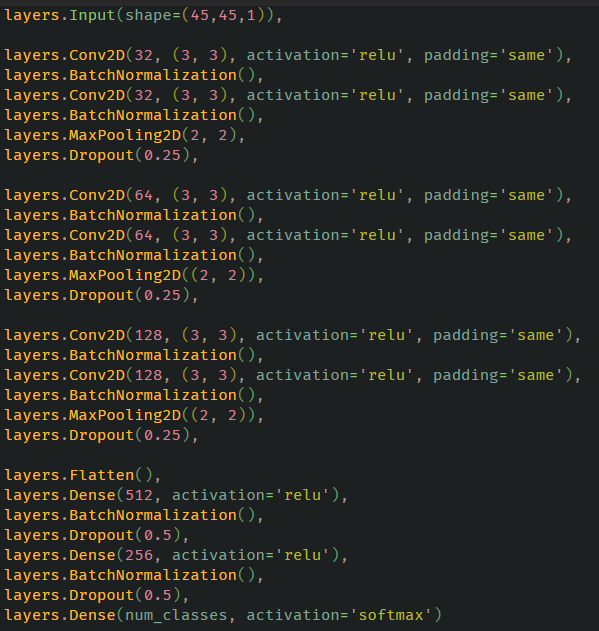

The details explained in the README.md file

## The workflow
>>**Input**: image
>>
>>**1.** Image preprocessing

>>**2.** Image segmentation

>>**3.** Segment prediction
>>
>>**Output**: expression

## Image Preprocessing
### Base idea
- Read the image
- Convert to Gray-scale
- Find contours
- Cut it out from the image

### Improvements
- Median Blur ( remove small noises )
- Covert to Gray-Scale
- Invert Color ( becouse the skeletonization )
- Skeletonization ( BIG improvement )
- Morphology Dilation ( Due to the dataset preprocessing )
- Find Contours
- Creating a mask from each contour
- Create an XOR copy of the mask and the image ( Preveting the bounding box issue for the close shapes )

## Model Training

### Version 1

### Version 2

### Version 3

### Version 4

### Version 5

## What is my dataset?

[Link](https://www.kaggle.com/datasets/xainano/handwrittenmathsymbols) to my dataset
I used 16 different image class in my project

Digits: 0, 1, 2, 3, 4, 5, 6, 7, 8, 9
Operators: +, -, \*, /
Parenthesis: (, )

## Why should I use multiple models for my dataset?

When I created a CNN model for all of my class it was very painfull to watch, because it didn't learn. The parameter space was too wavy and too bumpy it had too many local minimum

I created **4 modell**:
1. **Category model**, which predict that what **category** (digits, operators, parenthesis) the image belongs to.
2. Digits model
3. Operator model
4. Parenthesis model

## What model is better?

I created the versions from 1 to 5, but the 5th model is not the best!

If we see the data more carefully, we can see some patterns.
The 5th model using Hu Moments which invariant to rotation, scaling or transition. So the modell is bad for operators, due to minus and division sign.

The 4th model was the most successfull model, the training time was longer for a batch, but It learned with better scores.

## Custom Loss Function

F1 score is a good mesuremet for models, so I made a loss function which includes F1 besides the categorycal-crossentropy

## Further Improvements

### Improvements In Operator Category
>>The colon sign was very missleading, because it was very similar to the division sign.
>>So I removed it from the dataset, because if a **contour** is too small, than we can tell it is a point. 

#### Before Improvement

#### After Improvement

## Loss function changed
>>My loss function turnd into a categorical cross entropy and dice score combo

### Back to the beginning
>>I noticed when I trained the models they had 2.000.000 parameter, which is lot for this small data. So I wondered, after I improved the preprocessing is it worth it, if I tried my oldest model.
>
>It was very good, It leared very fast and achived better and stabler result then the later versions.
>The version 1 model has 100.000 parameter
>The result:
#### Submodels
>>close 99.9% it seems overfitting, but it isn't.
#### Base model
>>Accuracy and other scores was around 92% which is acceptable I think.